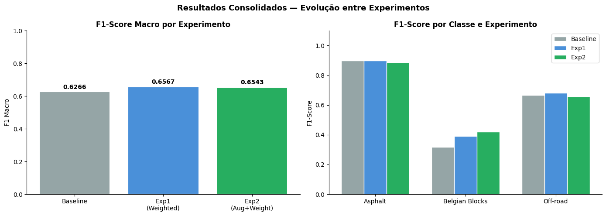
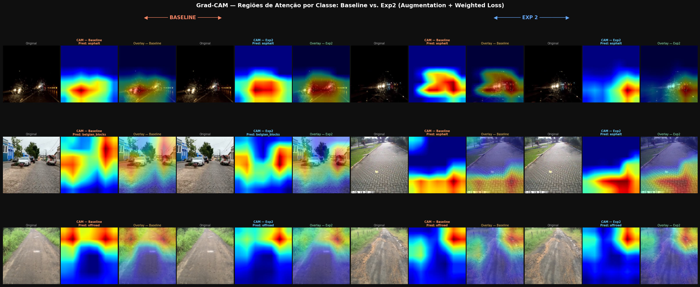

# 🛣️ Classificação de Superfícies de Vias — Voxar Labs

Projeto de Visão Computacional para classificação de tipos de pavimentação em imagens reais, com foco em robustez contra desbalanceamento de classes e variações ambientais.

---

## 📋 Visão Geral
Este repositório contém a solução do desafio técnico da **Voxar Labs (2026)**. O objetivo é classificar superfícies em três categorias:
*   **Asphalt** (Classe Majoritária)
*   **Belgian Blocks** (Paralelepípedo - Classe Crítica/Minoritária)
*   **Off-road** (Terra/Grama)

### Principais Desafios:
1.  **Desbalanceamento Severo:** Proporção aproximada de 7:1 entre a classe majoritária e a minoritária.
2.  **Variabilidade Ambiental:** Imagens com chuva, neblina, período noturno e diferentes ângulos de captura.

---

## 🛠️ Metodologia
A solução utiliza **Transfer Learning** com a arquitetura **ResNet-18** pré-treinada na ImageNet.

| Etapa | Abordagem Técnica | Racional |
|:---:|:---|:---|
| **Modelo** | ResNet-18 (Backbone congelado + FC Head) | Equilíbrio entre performance e eficiência computacional. |
| **Pipeline** | PyTorch + Stratified Splits | Garantia de que a distribuição de classes é mantida no treino/teste. |
| **Combate ao Viés** | Weighted CrossEntropy Loss | Penalização maior para erros na classe minoritária (*Belgian Blocks*). |
| **Aumentação** | Color Jitter, Motion Blur, Flips e Rotações | Aumentar a diversidade do dataset e reduzir overfitting. |
| **Explicabilidade** | Grad-CAM | Visualização das regiões de atenção do modelo para auditoria. |

---

## 🚀 Experimentos e Resultados

Foram realizados três experimentos incrementais para validar as hipóteses de melhoria:

1.  **Baseline:** Modelo básico sem tratamento de pesos ou intensas aumentações.
2.  **Exp 1 (Weighted Loss):** Ajuste dos pesos da função de perda com base na frequência das classes.
3.  **Exp 2 (Augumentation):** Inclusão de transformações geométricas e de cor para aumentar a invariância do modelo.

### Comparativo Final (Conjunto de Teste)

| Experimento | Accuracy | F1 Macro (Métrica Principal) | F1 - Belgian Blocks |
|:---:|:---:|:---:|:---:|
| **Baseline** | 81.67% | 0.627 | 0.316 |
| **Exp 1 (Pesos)** | 81.67% | 0.657 | 0.390 |
| **Exp 2 (Aug + Pesos)** | **80.00%** | **0.654** | **0.419** |

> **Insight Principal:** Embora a acurácia global tenha sofrido um leve decréscimo (*Paradoxo da Acurácia*), o Modelo Final (Exp 2) é o mais robusto. Ele elevou a detecção da classe crítica (**Belgian Blocks**) em **~32%** em relação ao baseline, garantindo maior segurança em aplicações de navegação embarcada.



---

## 🔍 Explicabilidade (Grad-CAM)
Utilizamos Grad-CAM para verificar se o modelo está "olhando" para o lugar certo (a textura da estrada) ou se está enviesado por elementos de cenário (árvores, céu). As visualizações confirmaram que o modelo foca nas regiões inferiores da imagem, ricas em padrões táteis de pavimentação.


*Comparação entre o modelo Baseline e o Exp2 (Treinado com Augmentation).*

---

## ⚖️ Rigor Científico

*   **Teste de McNemar:** Realizado para validar se a diferença estatística entre as predições é significante ($p < 0.05$).
*   **Validação Cruzada (K-Fold):** Para garantir a replicabilidade, o modelo final foi validado com 5-folds, atingindo:
    *   **Acurácia Média:** 93.92% (+/- 1.14%)
    *   **F1-Macro Médio:** 89.2% (+/- 1.8%)

---

## 📂 Como executar
```bash
# Instalação
pip install -r requirements.txt

# Execução
jupyter notebook notebook.ipynb
```
*Obs: O dataset deve ser colocado na pasta `dataset_processed/` na raiz do projeto.*

---
**Desenvolvido com foco em: Estrutura, Rigor e Comunicação.**
